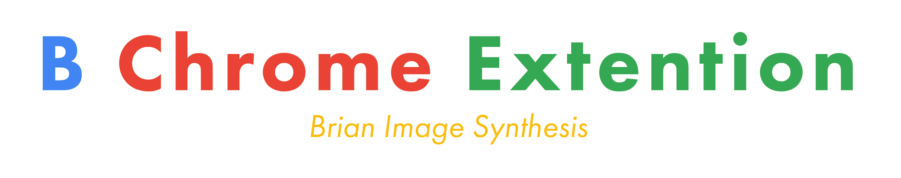
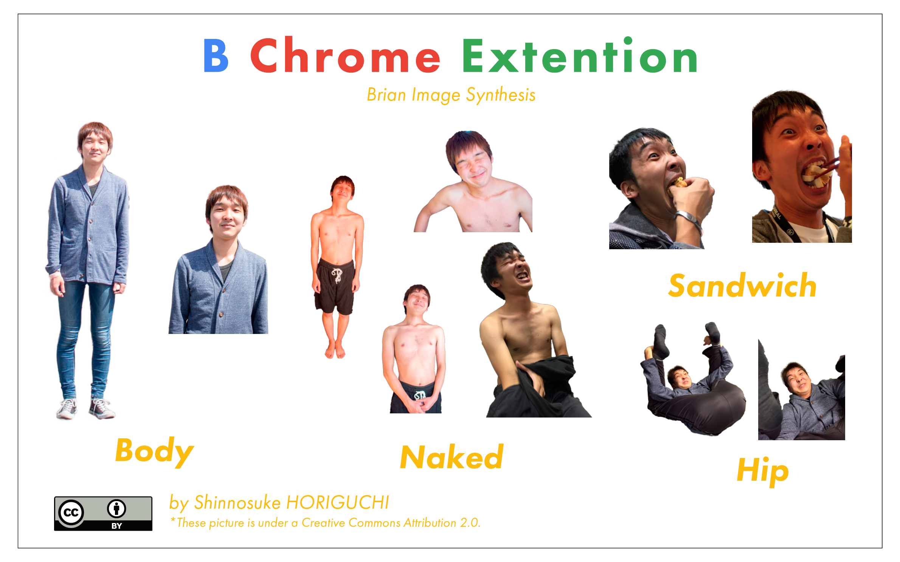
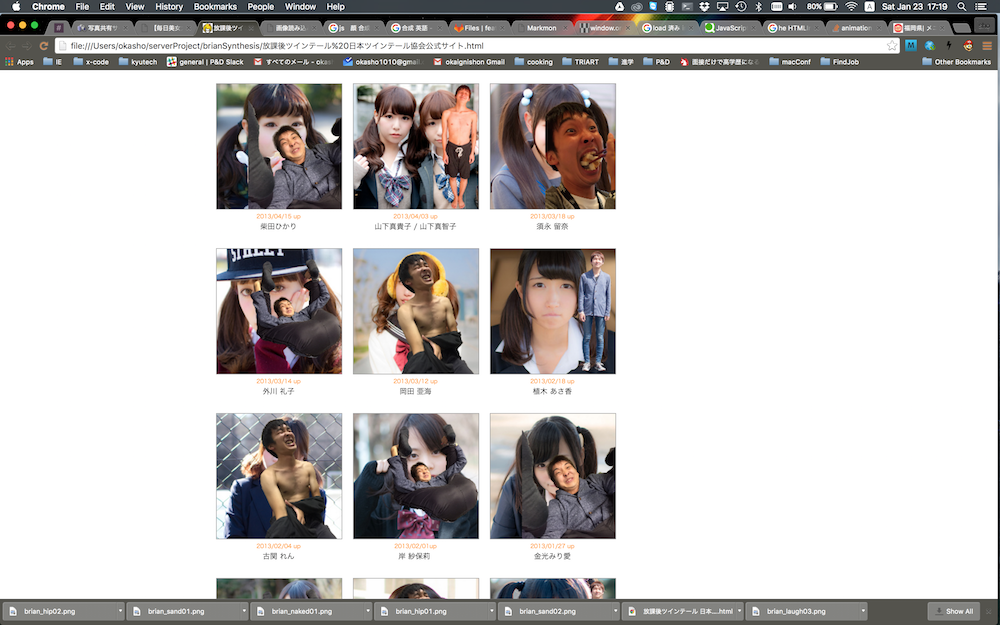
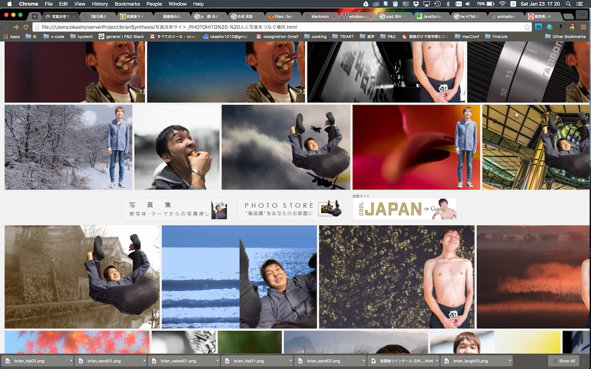

## 1.はじめに

**BChromeExtension** は、Google Chrome にてブラウジング中に表示される画像データを取得し、堀口慎之介( 通称:Brian )の様々なポージング写真(全身、半裸、グロテスクを含む)と合成されたものを表示させる Chrome 拡張機能である。

### ※堀口慎之介プロフィール

    山口県下関市出身。あだ名は、ブライアン。就活中。
    福岡工業大学短期大学部 情報メディア学科卒業。
    九州工業大学情報工学部 電子情報工学科3年在籍(2017年卒業見込み)。
    短大1年の時に友人と始めたフリーペーパー制作(DTPオペレータ)を4年間経験後、
    九州工業大学情報工学部においてITサービス開発・運用サークル「P&D」に所属。
    現在はチーム開発においてUIデザインを中心に活動をしている。
    2015年ではMashupAwards11、e-ZUKAスマートフォンアプリコンテスト等において
    グランプリをはじめ、様々な賞を獲得している。
    

## 2. 製品概要

### 背景(製品開発のきっかけ、課題等）

Google が提供しているブラウザ 「Google Chrome」では拡張機能を使うことにより、 Chrome をより便利に使うことができる。これらは [Chrome Web ストア](https://chrome.google.com/webstore/) にて無料でダウンロードすることができる。最近では Web ブラウジングの効率を良くする拡張機能の他にも、例えばWebサイト上で表示される画像に写っている顔写真にヒゲをつけることを可能にした [wurstify.me](https://wurstify.me/) のようなコメディ的 Chrome アプリのようなものも出回っている。今回はこれのシステムをリスペクトする形で、ヒゲではなく、P&Dの部員でおなじみのブライアンをあらゆるサイトの画像で表示させては面白いのではないかと考え、このアプリを開発した。

## 3. 使用方法

BChromeExtension は、Google Chrome に本拡張機能をインストール後、設定画面にて拡張機能を有効にすることにより利用可能となる。

## 4. 特長

ブライアンの画像の表示パターンのジャンルは主に以下の4種類である。

| ジャンル | 説明 |
|--------|------|
|Body|ブライアンの全身ポーズ|
|Naked|ブライアンの半裸ポーズ|
|Sandwich|ブライアンの全力でサンドウィッチを食べるポーズ|
|Hip|ブライアンのおしりを強調させるポーズ|

Chrome にて Web ページが読み込まれた際に、上記に示されているブライアンの画像がランダムに選ばれ、1枚の写真に対してブライアンが1人配置される。

### スクリーンショット

参照サイト：[放課後ツインテール - 日本ツインテール協会公式サイト](http://twintail-japan.com/after_school/main.html)

## 5. 注力したこと（こだわり等）
- ブライアンの過去の写真データから本人により厳選されたものが選ばれている。

## 6. 今後の展望

- 画像中に顔が存在する写真について、顔認識をしたのちに表示されている顔部分をすべてブライアンするシステムを開発中である。
    - 参考：[JavaScriptでPoisson Image Editingによる滑らかな画像合成](http://rest-term.com/archives/3066/)

## 7. 技術的情報など

### 活用した技術
- JavaScript

#### デバイス
- Google Chrome

### 独自技術
- 気合い（＾∇＾） by okasho
- めげないこころ( ´ ▽ ` )ﾉ by Brian